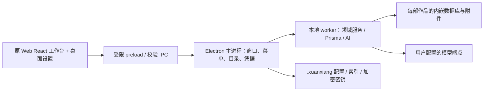

# 桌面技术方案

<!-- USER-2026-10-08-CANCEL-BACKUPS CURRENT-SCOPE BEGIN -->
> **当前范围（2026-10-08）：用户取消全部备份功能。** 备份scheduler/control/session/生成包、应用/作品备份恢复worker/preload/IPC/UI、升级dumpDataDir归档及迁移前额外数据备份快照退役。第5节下方备份导出/封包/候选启用协议仅作历史；schema迁移版本/事务、writer lease、关闭drain、草稿durability和目录迁移保持。旧authority/pointer/未知控制文件只能只读校验或安全拒绝，不能删除或当idle初始化空库；历史backups/snapshots目录不自动清理。
> 活动清单：[acceptance-active-scope.json](acceptance-active-scope.json)；原文和退役明细：[backup-scope-retirement.json](backup-scope-retirement.json)。此处不声明实现完成或验收通过。
<!-- USER-2026-10-08-CANCEL-BACKUPS CURRENT-SCOPE END -->

版本：1.0；日期：2026-10-07。前置：UI v0.13 用户批准及附加边界见 `implementation-boundaries.md`。本方案及清单已经独立审核23、24通过；现在产出正式测试用例，经审核后开始App实现。

## 1. 架构与技术选择

保留 Next 16.2.10 / React 19.2.4 / TypeScript / Tailwind 4 / Base UI / Zustand / TanStack Query / Monaco / Prisma 7.8 / AI SDK 7。Electron 版本在锁文件中固定并验包。Next 仅导出本地静态 UI，不启动 Next server、API server 或数据库 daemon；全部运行资源随安装包分发。



**数据库决策：使用 PGlite（嵌入式 PostgreSQL WASM）Node FS + Prisma 驱动适配。** 修订调研阶段推荐 SQLite 的技术选择，原因是上游包含数组/枚举/JSON、`FOR UPDATE`、事务 advisory lock、部分唯一约束、54 模型和大量事务；保留原数据库语义比重写这些规则更能保护正文。PGlite 在进程内执行、数据存本地目录，不安装 PostgreSQL、不开放数据库端口；不使用其 Socket/server/sync 模块。使用非 relaxed durability，事务完成落盘后才回执。该选择不改变产品或 UI。[PGlite Node FS](https://pglite.dev/docs/filesystems)、[事务/持久化 API](https://pglite.dev/docs/api)。

驱动实现 Prisma `SqlDriverAdapter` 接口。2026-10-07 注册表核验固定候选版本 Electron 44.6.0、PGlite 0.5.8、Prisma 7.8.0、pglite-prisma-adapter 0.7.2；开发 Node 使用24 LTS，版本锁定到lockfile。社区适配器只复用已审的 OID/参数/错误转换，**本地wrapper覆盖事务及executeScript**：上游源码存在executeScript未等待完成、隔离级别设置在事务外、事务结束错误可能不能正确回传的风险，不能原样接入。[上游实现](https://github.com/lucasthevenet/pglite-utils/blob/main/packages/prisma-adapter/src/pglite.ts)

wrapper 的 executeScript await 引擎结果；startTransaction 通过 PGlite.transaction 取得独占tx后才设置允许清单中的隔离级别，用deferred维持租约，返回Prisma transaction；commit/rollback完成要等引擎transaction promise，正确传播错误，释放租约一次且不会unhandled rejection。callback异常/Prisma超时/取消均到同一rollback完成路径。必须先通过参数化查询、OID/数组/JSON/日期/BigInt/错误码、交互事务提交/回滚/超时、嵌套服务和同库并发隔离契约测试。不得拦截 SQL 字符串删除锁语句或伪造成功。达不到契约即阻断此里程碑并修订技术方案，不悄悄退回平台数据库。

PGlite 单连接独占调度以**所有查询**为单位：交互事务从 BEGIN 至 COMMIT/ROLLBACK 持有该实例的 lease，外部读/写/控制面均排队；事务 callback 内只使用传入 tx，禁止等待同实例其他 Prisma client，避免自锁。超时必须先回滚并释放 lease，再恢复队列；取消不能使后续查询进入未结束事务。不同作品实例可并行，同作品内读不越过事务边界。嵌套领域服务传递 tx，不能重新取得默认 client。聊天 heartbeat/取消在事务外排队但通过短事务与Abort检查保证有界响应。

Next `output: export` 仅包含 `/` 工作台和本地错误入口；无动态服务器页面、Auth.js、在线管理台、Google 字体下载。构建阶段从本地资产生成字体样式，Monaco worker 本地打包。原 UI 通过本地传输适配保持数据 shape。静态导出不能直接包含动态服务 API。[Next 静态导出](https://nextjs.org/docs/app/guides/static-exports)

## 2. 目录与源码复用

```
src/app/                    静态 Next 入口、原 globals.css/providers
src/components/             从 Web 基线复制的原真实组件 + desktop/*
src/lib/ src/stores/         原领域/客户端逻辑；少量桌面边界替换
desktop/main/               窗口、系统菜单、凭据、目录授权、生命周期
desktop/preload/            有类型的最小桥接
desktop/core/               设置/快捷键/迁移/网络策略等可隔离测试逻辑
desktop/service/            worker、数据库适配、旧请求 contract 分发
desktop/handlers/           从原 API 路径提取的本地 command handlers
prisma/                    原 schema、随包版本迁移（无远端 datasource）
resources/                 本地字体/Logo/目录/模板/数据库运行资源
tests/                     单元、集成、组件、原生桌面及离线安装验证
docs/                      设计、需求/迁移台账、测试用例、审核与证据索引
```

初次导入记录每个原文件路径/散列/基线 commit，修改原因写 `reuse-manifest.json`。正式构建不复制 `design/desktop-preview.*`，不包含设计 fixture；禁止从父目录读代码/资源。源组件允许的差异见实施边界；业务视图不另建同名桌面简化版。

`migration-map.json` 对每个原 Tab/工具/路径/服务/模型给出本地入口、处理方式及验证编号。平台营销、认证、用户/套餐/管理员计费明确排除；管理员模板/提示词、模型能力迁入用户本地设置，不能整体删除。路由名是兼容 contract 的标识，不运行 HTTP 路由。

模板/提示词实际入口为「文件 → 模板与提示词」，打开原 Dialog primitives 承载的本地管理窗口，复用 `components/admin/PromptsClient.tsx` 及 `shared.tsx` 的列表、编辑、变量提示和保存交互，只替换在线管理员权限/传输，增加已承诺的本地导入/导出。创作模板仍由原 `CreateNovelDialog` 选卡/过滤/详情消费，内置模板和本地另存副本由同一离线库提供；不得复制设计稿的示例模板。保持七类设置导航，不新增第八分类或复制 AdminShell。该入口是既有 X11 能力的本地承载。

## 3. IPC、流与资源边界

注册标准、安全、支持 fetch/stream 的 `xaanink://app` 协议用于打包静态资源。`protocol.handle` 必须校验 host/解码后的规范路径、限定到资源根并拒绝 traversal/符号链接逃逸；不设 `bypassCSP`。`webPreferences`: sandbox、contextIsolation 开启，nodeIntegration 关闭。[Electron protocol](https://www.electronjs.org/docs/latest/api/protocol)

preload 暴露：`bootstrap`、`request`、`cancelRequest`、`subscribe`、`settings`、`chooseDirectory`、`chooseImage`、`saveExport`、`windowCommand`、`menuCommand`。不暴露任意 `ipcRenderer`、fs、shell 或 raw SQL。每次主进程入口验证发送者等于当前受信主 frame、版本化 schema、大小/类型/方法与已授权作用域。目录桥接返回 opaque grant ID；后续命令不能用 renderer 随意传入绝对路径取得新权限。

保留原 UI 的 Request/Response shape，用 renderer `localRequest`（必要时兼容其同源 `/api/*` fetch）转换为已登记 command + 参数。禁止拦截任意远端 URL；renderer 外网请求默认拒绝。Request body 支持 JSON、受限二进制/表单和导出响应，禁止无限 Buffer。handlers 调用原服务；`auth()` 替换为本地受信身份，仍校验实体同作品归属。

流协议为 requestId + workspaceId + conversationId + attemptId + monotonically increasing seq；MessagePort 分帧带字节上限、ack/背压、结束/错误/取消；订阅销毁、窗口关闭、模型撤销会 abort worker 任务。重复或迟到帧丢弃，用户切会话不取消另一个会话或串写。保留原 AI SDK SSE/chat checkpoint 协议，renderer 转成原 ReadableStream，真实完成回执才能结束 busy 状态。取消不得绕过 chat-write fence。

图片/附件统一 `xaanink://asset/<workspace-id>/<asset-id>`，主进程通过已授权 manifest 查询，不直接传原路径或下载远端图像到 renderer。外部链接只允许经过明确用户动作的文档/反馈 URL，用系统浏览器；拒绝任意导航/window.open，下载通过原生保存选择器。

## 4. 数据位置与跨作品作用域

默认根 `path.join(os.homedir(), '.xuanxiang')`（两平台）；引导指针仅记录权威根和迁移恢复状态。根内为 settings/versioned JSON、catalog、encrypted secrets、global library/inbox database、草稿恢复、日志、备份及 Electron sessionData（缓存也迁入根）。系统凭据保护信息仍按 OS 存放。

每个用户明确选择的作品目录包含 `xuanxiang-work.json`（UUID/schema版本）、`database/`（PGlite）、`assets/`、`snapshots/`、`backups/`。不因改名换路径；打开/重新关联验证 UUID、版本及目录可写。创建仅接收未过期目录 grant；空目录才能创建，原作品必须走打开。不同目录相同 UUID 提示重关联，不静默复制成另一作品。

本地 catalog 仅记录作品索引以及实体/会话到作品的定位，不存正文；每库保留一个本地作者行以维持关系校验。全局模型、配置与模板由独立 repository 提供，避免向每部作品复制密钥；Prisma `AIModel` 等全局读取边界由服务 resolver 显式改造。用户导出作品不含全局密钥。

**跨库关系定型**：数据库外键只指本库。每作品/inbox保留内部固定 `local-author` User 行，真实可编辑用户资料由全局配置提供，不用其Web套餐/密码列做鉴权。原 AIModel 表在作品/inbox仅作为**不可调用的无密钥引用行**（相同model UUID、provider/model ID/name/kind、`apiKeyEncrypted=''`、`enabled=false`）；不是全局模型配置副本，任何生成解析均禁止读取此表取得授权。记录 UsageRecord 前在同事务确保作者/ModelReference存在，再写用量和实际模型/授权版本/价格是否配置的不可变 JSON 快照（schema新增 modelSnapshot）。全局删除模型只撤销全局授权，不删除本地引用行或历史用量；UI无价格时显示未估价，不把0当免费。

作品导入/重新关联保留原 model UUID和快照，不把同名型号自动连到本机凭据；用户显式选择本机模型后新任务使用新ID，旧用量不变。旧格式作者ID由迁移表映射到local-author，并在一个本地事务更新其依赖，再校验FK；失败保持原包。所有User/AIModel/UsageRecord的清单位置均按此双层语义记录，不能留下跨库FK或复制Key。

worker 根据受信 catalog 与路由实体 ID 解析库，不相信 renderer 声明的 workspace。AsyncLocalStorage 固定请求/任务的 DB context；`prisma`/`controlPrisma` 从该 context 获取实例，不用 mutable global 指向当前作品。作品列表从 catalog 聚合，跨作品会话列表读持久索引，未关联会话留全局 inbox；关联作品时以可恢复转移日志搬迁完整会话/消息/turn关系，再原子更新归属，失败保持原库权威。建书延迟回执与 AI startNovel 都必须等目录授权，禁止默认选路径。

每作品独立串行写入门、读操作与交互事务由适配器正确排队；数据库实例 LRU 只淘汰无任务且已 flush/close 的库。单实例锁防止两个 App 写同目录；路径 realpath/casefold（按文件系统）、inode/file ID 与 symlink 边界核验。网络盘/同步中的活动数据库不默认接受，需提示复制到本地；不得假定路径字符串验证足够。

所有原 CAS、operationId 幂等、ContentMutation 快照、候选/批准/定稿、评论锚点、chat lease/write fence 继续在事务内执行。数据库迁移按随包版本和 checksum 执行，升级前快照；失败不标已升级、不打开空库。不要在用户库执行上游含管理员账号/平台 Key 的 seed；内置模板单独提取并按默认 hash 保护用户修改。

## 5. 应用根迁移、备份与退出

迁移状态机：idle → native-picking → validating → quiescing → copying → verifying → committed → cleanup → complete；提交前取消/失败→rollback，提交后清理失败→cleanup-pending。点迁移先原生目录选择，确认后才进入过程；确认时说明旧根管理文件的清理范围与作品不移动；关闭后从实际清单显示文件总数，不在原生目录选择前展示虚构大小。默认作品父目录选择仅设置建议，不授予创建权限。

运行中迁移采用完整进程交接：原工作台的请求准入门先停止新增业务写入，等待在途IPC、草稿/设置flush及数据库close，才把当前目录选择请求持久化为armed。`app.relaunch()`在当前实例退出后启动维护进程；维护分支在首个await前为sessionData设置固定bootstrap中的维护缓存位置，其窗口使用不持久化的独立session，绝不打开源数据库或源Chromium session。原生实例锁始终位于固定bootstrap。bootstrap只承载控制记录与临时维护缓存，作品/配置/密钥/常规会话仍存用户数据根。该生命周期依赖[Electron relaunch和sessionData时序](https://www.electronjs.org/docs/latest/api/app#apprelaunchoptions)及[非持久化session](https://www.electronjs.org/docs/latest/api/session#sessionfrompartitionpartition-options)。

维护进程仅暴露状态与取消/继续/退出三种操作；prepared请求不自动迁移，armed转executing后用随机executionNonce作为核心migrationId。恢复必须校验同nonce、源指针及目标身份的journal，不将无journal的executing当成可重新执行。进度来自实际受管清单与复制回执，不复制设计示例数字。返回工作台先精确ACK已展示结果，再完整冷启动。取消写入未确认时保留交接所有权和关闭的业务准入门，提供重试取消；不能显示成功取消或继续编辑。新根合法保存后，旧迁移散列仅用于判断旧副本能否删除，不能当作新根启动版本限制。

迁移使用单独 durable journal：写临时 journal + fsync + 同卷原子 rename；暂停新任务、flush 草稿/设置、关闭全局库；仅复制 app-owned allowlist 和会话缓存，拒绝 symlink 外逃；全量清单与散列校验；新根保存恢复快照；原子切换引导指针；旧根只删有匹配 ownership/散列的本应用文件，保留目录及未知文件。目录嵌套/同根/不可写/空间不足/非空冲突均在提交前拒绝。崩溃按 journal 阶段恢复权威根，不合并两份。根失联提供定位/恢复，不默认重新初始化。

备份使用引擎一致性导出/暂停落盘后快照，加资源清单/校验和/schema/作品 UUID；不直接复制活跃数据库目录。保留数量清理只能在新备份完整且校验成功之后。恢复先校验，再导入隔离候选库，保留当前库和恢复前快照；经作者选择启用，原始正文候选/版本规则不绕过。

作品备份封装为作品`backups/`下独立UUID命名的`.xxbackup`文件：有界JSON清单、gzip引擎导出、不可变附件、每段SHA256及覆盖清单/载荷的整体SHA256。密钥库和设置文件不进入作品封包；损坏或陌生文件不参与自动保留清理。当前单包上限512MiB、附件合计256MiB/4096个，超限明确失败且保持旧有效备份。恢复先有界解压并验证普通tar条目、路径和PostgreSQL主版本，再导入作品`.xuanxiang-restores/`内新UUID候选目录，核对迁移ID/校验和、作品归属及附件引用，关闭候选引擎后保存完整文件/目录身份与散列。候选的读取验证不打开引擎；启用前任何变化都需重新准备候选。

作品的权威存储指针独立于原Web作品manifest；另写存储保护标记。保护标记存在而指针丢失时不得自动回退原库。启用恢复必须持有原作品writer lease、停止该作品新请求，并保留启用前最后状态。没有活跃引擎时不尝试打开坏库：将闭库database/assets按实际字节、目录、缺失项清单复制并校验到`.xuanxiang-preserved/UUID`，指针previous.kind明确记为closed-source；它不冒充可直接导入的健康数据库备份。未知作品文件不删除。lease只删除自己创建的owner文件与确认空的锁目录，部分解锁失败可由同一持有者显式重试。

恢复启用使用完整应用交接：原生确认后复用关闭流程停止任务、确认草稿落盘、排空业务与自动备份并关闭worker；独立afterClose阶段写入`restore-draft-barrier.json`，启用候选、持久保存结果、再次闭库后冷重启。该阶段失败不得恢复旧编辑器，重试只继续交接，不再次flush旧缓存。新bootstrap绑定当前窗口/token，强制把旧草稿与缓存作为惰性副本保留，经两次checkpoint和精确DraftJournal回执才清保护标志；unknown pending不得重做activate，也不提示成功。保护标志随应用根迁移。

PGlite的[官方导入导出API](https://pglite.dev/docs/api#dumpdatadir)只承诺供兼容PGlite加载的datadir包。实现结合锁定安装版本源码：0.5.8的`dumpDataDir`本身不获取查询/事务互斥锁，故按附件变更锁→事务锁→查询锁顺序导出，等待实际已开始事务结束；不在该锁内再借用默认数据库查询，防止自锁。备份版本来自项目锁定引擎版本及实际`SHOW server_version`，恢复不自动跨PostgreSQL主版本。

快照metadata记录PGlite版本及内嵌PostgreSQL主版本。原始dataDir恢复只接受明确兼容的引擎版本；跨主版本先用旧引擎导出支持的逻辑数据到隔离新库并验证，不直接覆盖打开。升级失败保留旧引擎/原数据和导出包，包内版本不受信时拒绝恢复。

关闭窗口先请求 renderer flush，等待所有草稿实际确认，再关闭库。保存失败提供重试/导出草稿/取消关闭；生成中先确认停止。macOS 最后窗口关后应用仍在、Dock 激活重新打开；Windows 最后窗口关退出。崩溃恢复来自定期 durable 草稿，不由缓存的“已保存”徽标推断。

## 6. 原生窗口、菜单与历史

macOS 使用 `titleBarStyle: hidden` 和原生 trafficLightPosition，窗口标题不可见；侧栏顶部给系统按钮保留区域，后退/前进/收起依次排列。Windows hidden titlebar + 原生 Window Controls Overlay，菜单图标在右侧窗控左边，预留系统报告的 overlay rectangle。所有栏顶空白设 app-region:drag，交互元素 no-drag；全高边界保持原 Panel 分割，禁止另加横贯标题/底栏。[Electron 标题栏](https://www.electronjs.org/docs/latest/tutorial/custom-title-bar)

窗控/导航是原组件的插槽，sidebar 隐藏时移至当前可见面板的头部，不挂载第二份编辑器；Windows 各显隐组合和100/125/150/200% DPI验证命中区域。后退/前进记录 view/tab/selection 的应用历史，边界禁用，不调网页 back 导致离开本地 App。

macOS 原生 Menu 六组：玄印/文件/编辑/视图/窗口/帮助；Windows 右上入口五组，设置/退出归文件，关于归帮助。统一 CommandRegistry 供原生 Menu、Windows 菜单、键盘和设置列表引用；内建角色和自定义命令都注册稳定 ID/条件/作用域。执行编辑命令作用于菜单前聚焦的 Monaco/composer/input，不对当前按钮执行。

Mac 关于使用 `app.showAboutPanel` 与实际版本；Windows 独立受限 About BrowserWindow。设置关于页也读 `app.getVersion()`。帮助 URL `https://xuanxiang.ink/docs` 暂禁用，禁止自动探测；反馈只在点击后打开指定 repo 的 issues/new/choose。

## 7. 设置 React 实现

`components/desktop/SettingsDialog` 复用原 UI primitives/语义令牌；纯左右、左标题19/17px、右上关闭、无重复分类大标题及底部保存取消；右内容真实滚动视口避开辅助反馈/关闭区域。七分类顺序固定。短配置单行左右，目录/主题和全部模型属性上标题下全宽；外阴影，两主题与窄窗对照批准截图。

主配置采用 optimistic draft + versioned atomic acknowledgement：非法输入保留但不应用；持久化失败回退运行值、保留待处理值/重试；以 config revision 拒绝乱序回执。用户/模型有独立事务草稿，只有保存提交；取消/关闭丢弃。模型测试不保存。外点关闭所有设置子层、阻止穿透、使异步预览和测试 session失效；最高层焦点 trap、Escape/返焦/屏幕阅读名称保留。

通用全部行：应用数据根/迁移、默认父目录/选择、启动恢复、备份间隔与保留数量、立即备份、配置导入、配置导出。配置导出排除密钥，导入有 schema/版本/冲突检查，不能隐式迁移或请求新端点。

用户卡片语义渐变、纯编辑图标；编辑左侧全高头像（原生图片选择、格式/大小/解码校验），右笔名/邮箱，保存/取消。保存后原账户菜单同步，Email只是本地资料。

智能体五项：文本默认/标准或计划/思考/审核默认/图像默认；仅已保存启用相应模型，Logo随型号；移除引用显失效，不自动补位，作用于新任务。正文外观用 Monaco `updateOptions` 和 CSS variables 更新，保留model/undo/cursor/comment；预览无行号，源码换行默认 false。

主题界面第一行，宣纸/玄墨/系统三张无文案占位图，无棕色角标；system 订阅 `nativeTheme`选择两套色板。界面字体/字号/缩放、正文字体/字号/行距/行号/换行逐项接入。读取实际可用本地字体和明确回退；不从网络取字体。

## 8. 本地模型目录、调用与密钥

预设供应商和 Logo 以 `provider-ui-presets.md` 为准；文本/文生图仅列支持输出类别的供应商，自定义两类可用。文本和图像分组卡片无选中高亮。配置预设只显示供应商、Key和模型单选搜索下拉；自定义按协议显示名称、Base URL、ID、Key、上下文K/M等必要属性，无用途/分类/输出上限。

每供应商 ProviderAdapter 定义 region/baseURL、协议、discover(cursor)/完整分页、输入输出能力、testText/testImage、generation、usage、cancel；不得按名称猜图像能力。`provider-catalog-research.md` 的逐供应商能力证据进入注册表。不支持授权发现时显示完整官方目录和权限待验证；目录/验证结果带来源/时间/Key授权版本，刷新失败不删已存模型，循环cursor/上限超出报不完整而不冒充全集。Google等原生接口单独适配，不能强发 OpenAI 请求。

Key 的 `safeStorage`加密/解密**全部在主进程**，worker仅接收绑定modelId/authRevision/requestId的短生命周期授权密钥，任务结束/撤销后丢弃引用；renderer读取只能掩码。加密不可用则拒绝保存。更换Key/供应商/协议/端点递增authRevision、取消旧请求和权限缓存；编辑留空仅保留原授权范围密钥。配置/作品导出不含密钥。[Electron safeStorage](https://www.electronjs.org/docs/latest/api/safe-storage)

所有文字、抽卡、摘要、评审、子任务、图像、重试/恢复统一 ModelResolver：显式模型 > 对应任务默认，审核与图像分开；记录不存在/停用/无Key/能力不符返回准确阻断并打开相应设置，保留原稿，不请求平台后备。移除套餐、Auto/Kimi隐式改路由与平台余额；若旧UI需要默认选项，仅映射明确本地默认且标名，不能暗取最新模型。

上述默认仅用于**初始化新会话/新任务**，初始化后记录具体模型ID。已有会话显式空选择或失效选择绝不再落到默认；分别提示未配置/未选择/已失效。删除模型清除默认引用，停用保留同ID的失效引用，显式重新启用后才恢复；没有自动补位。换模型时原思考档位受支持则保留，不支持才回到该模型明确支持的默认档位。

最终网络出口 `authorizedModelFetch` 在**每次实际请求发送前**核验 modelId/authRevision/endpoint/kind/enabled/Key 状态，包括 AI SDK 自动重试、目录发现、图像资源、子任务和恢复重发；旧快照即使已取得Key也不能再发出。任务持有的 AbortController 按授权版本登记，撤销先同步失效版本再取消在途；回执/流也校验版本。测试草稿使用独立的短生命周期授权记录，取消即失效，禁止通过通用worker fetch绕过出口。

测试连接直接冻结当前单选草稿、锁字段/保存/再测，spinner；短文字或1图，协议必需token上限内部补齐；完成结果弹层，关闭返回草稿。取消和外点Abort并递增sessionToken，迟到结果无效。错误脱敏，无请求体/Key日志。生成网络只向用户选定供应商接口；redirect校验同授权origin，跨域资源下载不携带Authorization且按供应商资源规则校验，大小/MIME/超时限制，资源本地化。

## 9. 快捷键与输入

统一命令注册源，装配 Monaco 后合入 `getSupportedActions()`和当前键位信息；MD、AI composer、普通输入、全部菜单可搜索（包括未绑定）；不能把原型131条当全量。每平台 commandId→有序绑定数组，可添加/逐项编辑/删除到空。菜单主键显示第一项，多余组合也执行同命令。系统保留只读。

录制读取keydown/code/key/modifiers，忽略repeat/IME/Dead，只修饰键不能保存；录制Tab/Escape后转保存焦点，显式重录/追加chord。规范化Plus/Shift+Equal及平台名称，保留小键盘差异；非美式布局单列验收。搜索覆盖全部绑定及默认值；冲突同scope/全局及chord前缀检测，互斥输入可复用。跨命令弹层显示全部冲突和取消/删除冲突绑定再保存/跳转查看，原子提交整批；失败两边保持，系统键及同命令重复拒绝。

应用聚焦期间路由，避免 `globalShortcut` 抢占系统其他应用；native accelerator只注册适用一段主键，其余由focused dispatcher处理并抑制重复。录制/模态/IME最高优先级，菜单前focus恢复，Monaco与默认编辑键由同一个scope仲裁；改键时释放旧binding，恢复默认只改本平台且确认。

## 10. 构建、测试与完成门

源码/lockfile独立，打包包括 Next out、preload/main/worker、Prisma生成文件、引擎WASM及本地字体/模板/Logo；资源路径基于app资源根，原生模块（如sharp）按目标架构重新构建。macOS arm64/x64 和 Windows x64 各构建并在对应系统启动安装产物；交叉打包不等于验收。签名凭据未提供时清楚标注未签名开发产物，不伪造公证。

TDD以边界为批次：先RED（正确行为缺失而非依赖/语法失败）→最小实现GREEN→重构→code review。数据库适配/持久化/迁移、IPC路径与流、模型授权、快捷键冲突先隔离测试，再原组件集成，再真实桌面。`05-test-cases.md`以及机器清单逐条记录前置/真实操作/预期/平台/证据，所有本轮要求和迁移条目有ID，不用覆盖率百分比代替功能验收。

UI验收同数据、同主题、相同窗口尺寸，逐个Web面板对照、实操全部菜单/快捷键/设置；原生目录/系统窗控/拖拽/IME必须在目标机器。故障注入只作用隔离目录及mock端点；真实供应商需要用户提供可用配置及调用授权，缺失记待验收。Windows可用真实GitHub Windows runner执行安装包/Electron自动化，并补交互桌面的OS动作证据；没有证据不得称双平台通过。

最终退出条件：全部要求/用例和原能力映射完成、无占位/远端平台回退、独立构建安装通过、两个目标系统用户操作证据、数据可靠性通过、code review无阻断；仅此时写完整完成总结。阶段性成果据实记录，不把设计/自动化清单误称App完成。
