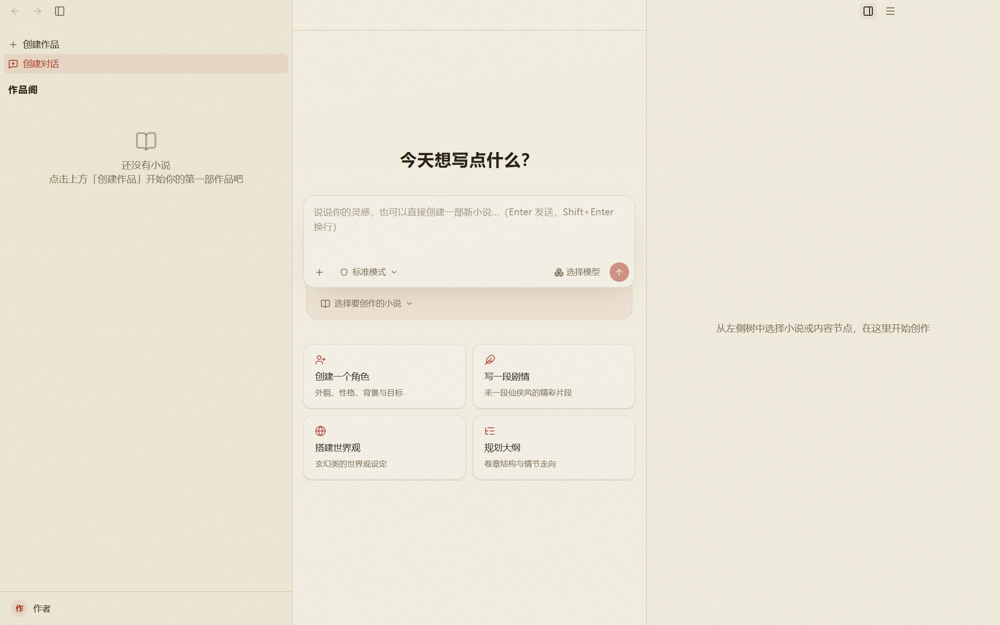
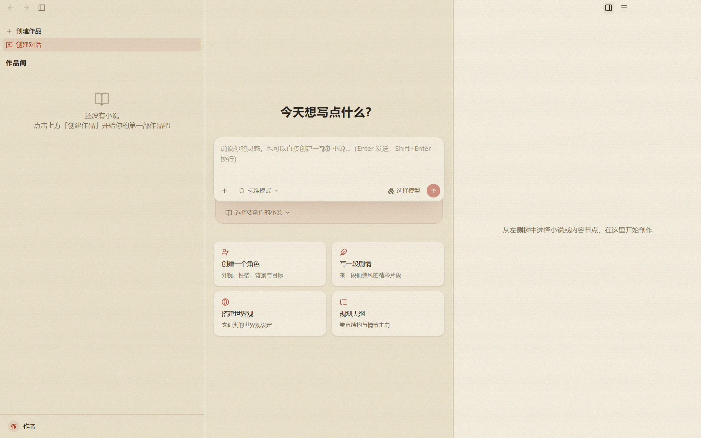

# 工作区分割线与宣纸底色设计

日期：2026-10-10。第三版，状态：用户已审核通过并要求继续。依据：[调研文档](2026-10-10-workspace-surfaces-research.md)及用户第三轮反馈。

宣纸三栏整体提浅，保留两侧略深、中间略浅的关系，同时让右内容区更接近 AI 区域。分割色调浅，所有 UI 结构分割线以同一种细边框方式绘制，竖线与横线等细；继续保留纸纹，线旁不留亮色沟槽。

## 设计预览

以下画面来自现有 Windows Electron 真实 React 工作台，使用全新隔离目录、无作品、无配置模型的空态。第三版只在预览进程中临时应用设计样式，产品代码尚未修改。截图为渲染区域，不包含系统原生窗控。

修改后：

当前：

[打开前后对比稿](../../design/workspace-surfaces/index.html)。

## 颜色与分割线

| 元素 | 第二版 | 第三版已批准方案 | 效果 |
| --- | --- | --- | --- |
| 左导航底色 | `#efe6cf` | `#f5eedc` | 提浅，仍略深于中间 |
| AI 区域底色 | `#f9f4e4` | `#faf6e8` | 略微提浅 |
| AI 气泡及输入框表面 | `#fcf8ee` | `#fcf8ee` | 保留比中间主底略浅的层次 |
| 右内容主表面及正文 | `#efe6cf` | `#f8f3e4` | 明显提浅，更接近 AI |
| 左右分隔条 | 1px 实色条 | 与其他 UI 相同的 1px 边框声明，仅边框占位 | 横竖等细，无额外沟槽 |
| 宣纸分区线 | `#b8a783` | `#d8cba6` | 恢复较浅的通用分隔色 |
| 玄墨分隔线 | 实色条 | 使用现有玄墨色的细边框 | 底色保持原主题 |

AI 与右内容的 RGB 色差由第二版的 `(10,14,21)` 缩为 `(2,3,4)`；AI 与导航缩为 `(5,8,12)`。三栏都往浅色方向调整，右侧与中间更接近。颜色值为纸纹叠加前的底色，实际画面继续使用真实纸纹。

结构分割线统一以常规 1px 边框声明为基准。范围包括分栏、顶栏、账户、标签条、窄窗导航，以及菜单和业务面板中的结构线；已符合的原细线保持。标题装饰、选中标记、焦点和状态圈不是分割线，保留自身样式。

## 实现范围

三栏配色只在宣纸工作区局部接入。右内容采用专用底色变量，规划、场景、正文、行号槽和右标签条同步为 `#f8f3e4`。AI 内嵌编辑器不受右侧局部配色影响，全局主题变量保持原样。

左右分隔条改为零内容宽度加细边框，总占位只有浏览器实际绘制的边框厚度，取消实色底条和内嵌子线。拖拽仍使用原库的不可见命中范围，hover 和 active 在线内反馈。真实四大布局组件、29 类面板与编辑器继续复用。

两栏时导航略深、AI 略浅；三栏时右侧比导航更浅、更接近 AI。显隐、全屏及窄窗遵循原逻辑，不重新挂载编辑器。统一 caption 的结构线宽时，保留已批准的原生窗控安全区、高度和间距；不同缩放下的视觉一致性在实施后逐项验证。

## 设计预览核对

[`preview-observations.json`](../../design/workspace-surfaces/preview-observations.json) 记录第三版：左 `rgb(245,238,220)`、AI `rgb(250,246,232)`、右 `rgb(248,243,228)`；分隔色为 `rgb(216,203,166)`。在当前 DPR 1.5 的预览中，声明 1px 的边框实际使用宽度约 `0.666667` CSS px，横竖均相同，对应 1 个设备像素。分栏只有边框占位，无子线，面板与线直接邻接。

这些记录仅核对设计预览，不能作为已实现或产品测试通过的结论。独立审核记录见：[设计审核](2026-10-10-workspace-surfaces-design-review.md)。

第三版查看器已在 1440px 与 360px 宽度核对：图片正常加载，前后切换正常，无横向溢出或脚本错误，记录于 [`viewer-checks.json`](../../design/workspace-surfaces/viewer-checks.json)。这属于设计查看器检查，不能作为产品测试。空态截图不证明菜单、业务面板、右规划、Monaco、实际拖拽或其他缩放状态通过。

## 审核后的实施与测试

用户确认以上效果后，先完成独立技术与用例审核，再为样式和分隔线添加有意义的回归用例并记录旧代码失败，随后实现与独立 code review。测试记录区分自动回归、构建、全量结果及真实 Windows 界面验证，按调研中的状态逐项核对；全部要求通过后再输出完成总结。

调研与第三版设计已交付，用户明确回复“UI 审核通过，继续”。进入[实施方案](2026-10-10-workspace-surfaces-plan.md)、独立审核及实现验证阶段。以上预览证据仍仅代表设计阶段，不作为产品回归验收。

前两版分别保存于 `design/workspace-surfaces/archive-v1/` 与 `archive-v2/`，已被替代，不作为实施依据。
