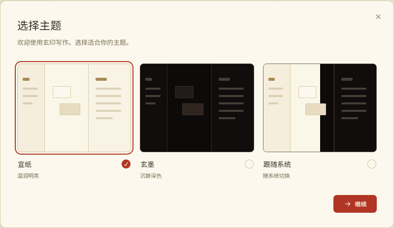
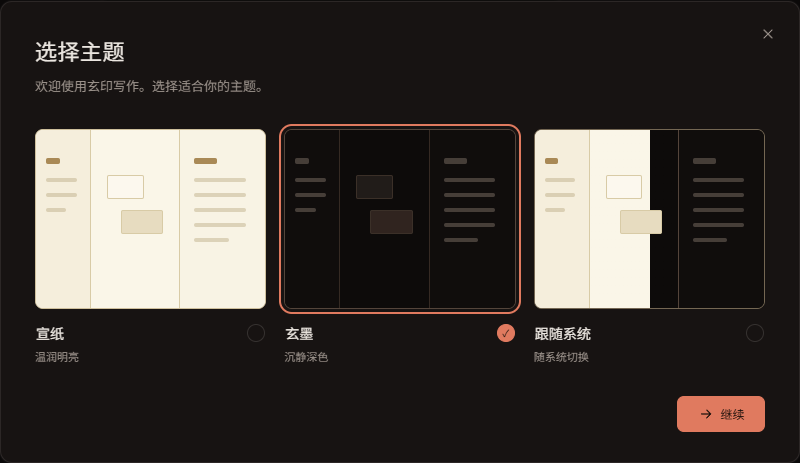

# 新手引导 UI 设计稿

日期：2026-10-11（Asia/Shanghai）。版本：v3。状态：用户已批准最终 UI v3，进入技术方案阶段。

产物顺序：[调研文档](2026-10-11-onboarding-research.md) → [产品设计文档](2026-10-11-onboarding-product-design.md) → 本文及 [HTML 交互设计稿](../../design/onboarding/index.html)。本次用户明确要求 HTML 审核后再实现，用户已于 2026-10-11 明确批准最终设计；继续技术方案、专项用例审核、实现和相关测试。

## 查看方式

打开 design/onboarding/index.html，默认即显示首次启动的独立主题对话框。可以在弹窗中顺序操作，也可以使用页面上方的审核工具切换完整/仅模型流程、查看步骤、主题、窄窗/短窗和失败状态。审核工具在 iframe 之外；应用内对话框使用原生 dialog，焦点和背景限制在自己的预览文档内。

模型字段使用明确的设计占位。审核交互可填写 `preview-placeholder`，不能输入真实 Key。模型、资料与恢复状态只在本页内存演示，刷新即重置，不调用本地应用桥、不写 localStorage、不访问供应商。头像只切换抽象图标，不读取本机头像文件。“测试连接”仅演示脱敏反馈，不伪造连通成功。

## 页面与视觉

此前 v2 按用户截图反馈完成以下修订：所有引导弹窗移除标题上方的流程步骤条；主题页删除下方“选择立即生效……”说明、“主题已应用……”正常提示和“先从舒适的界面开始”装饰文案；标题改为“选择主题”；放大主题对话框及三张主题示意图。实际保存异常仍在当前页反馈。v3 保留这些修改，统一所有配置页的“继续”，并重设计欢迎页。

独立主题对话框从 660 CSS px 放大到 800 CSS px，v2 常规截图实测高约 462 CSS px，超过首版约 439 CSS px；三张无文字工作区示意图从 112 CSS px 增高到 180 CSS px，内部线条和布局比例同步放大，分别显示宣纸、玄墨与跟随系统。资料、模型及 v3 欢迎页为 560 CSS px；文生图询问扩至 640 CSS px，缺文本模型短入口仍为 520 CSS px。沿用现有主题变量、印章色主动作、字体与局部细边框。

宣纸主题：

玄墨主题：

完整顺序：主题 → 用户信息 → 文本模型 → 询问文生图 → 可选文生图配置 → 欢迎使用。主题、用户信息、文本模型及文生图模型的主按钮统一为“继续”并带前进箭头；资料与模型均手动保存成功后才推进。文本确认同时配置默认文本与审核，图片确认配置默认文生图。模型页不显示默认用途提示框；文生图询问与编辑都有“跳过”。

供应商下拉列表中，DeepSeek 排文本首位，其余国产供应商随后，OpenAI、Anthropic、Google、xAI 排在国产供应商之后，自定义供应商最后。文生图列表仅保留其原有可选供应商，按相同分组顺序排列；首次显示的供应商图标与选中项一致。

仅模型流程直接从文本开始；外部侧边审核索引只列文本、文生图、欢迎使用，弹窗内不显示流程步骤。短流程入口可暂不配置。退出完整引导保留已确认配置，下次继续未完成步骤；未提交 Key、头像与字段草稿清空。

欢迎页以迎接用户开始创作为核心，替代原来的完成图标与配置摘要清单。顶部居中展示随主题切换的 68px 玄印品牌印记、28px 标题“欢迎使用”及“玄印写作，陪你把灵感写成作品。”。正文用已保存笔名称呼用户：“{笔名}，你好。”，接“从一个灵感、一段文字开始，写出属于你的作品。”。底部只保留居中的“开始创作”主按钮（常规宽 200px、高至少 42px），点击进入工作台。没有配置清单、模型名称或连接成功宣告。

欢迎页在完成状态保存成功后才出现，完整与仅模型流程使用同一版式。关闭和 Escape 也回到工作台；不会自动创建作品或发起模型调用。笔名按文本转义，长笔名换行，正文可滚动；短窗缩小印记、字号与间距，标题和主按钮保持可达。这些是当前源码设计约束，尚未重新渲染验证。

文生图询问页的“给文字添一幅画”卡片按用户最新要求改为“角色＋场景”的宣传展示拼贴图。左侧保留青玉色与白色汉服、黑发玉簪的仙侠角色，右侧独立呈现云海山峦、楼阁、石桥与水面，使用斜向拼贴接缝串联两部分。内置图像生成工具以原角色图为参考，生成 1774 × 887px 横幅，已保存到 [新展示素材](../../design/onboarding/assets/xianxia-character-scene-v2.png)，[最终提示词与来源](../../design/onboarding/assets/xianxia-character-scene-v2.md)同步保存。对话框从 520px 扩至 640px，卡片改为上图下文；图片铺满卡片宽度，按 2:1 等比缩小，完整展示人物与场景，替代文本同步说明拼贴内容。它是静态能力展示，不是用户头像、用户作品或当前配置模型的测试结果。原肖像与其生成记录保留为历史素材。

整张拼贴图新增点击入口，原生 button 的可访问名称为“配置文生图模型”，与底部配置按钮复用 `accept-image` 动作，点击只切换至图片模型配置。鼠标悬停变为手形；画面轻微推进，深青色衬底渐入，随后浮现同名配置文字。文字采用系统楷体、22–30px 暖白金色字，配克制的细金线与字距；窄窗改为居中、17–26px，以保持完整可读。按用户最新要求删除移动光带图层、状态变量与样式，原素材不重绘。

键盘聚焦有相同文案和焦点框，Enter/Space 原生触发，与下方按钮同效；装饰图层不接收指针事件、不进入无障碍朗读。触控直接点击，底部按钮保持可见。减少动态效果时直接显示文字/衬底，停用画面推进。提交锁同时禁用图片按钮与其他操作，禁用时不出现悬停提示或手形。

## 设计查看器检查

历史执行命令：`node design/onboarding/capture-preview.mjs`。2026-10-11 v2 主题修订后的运行退出 0，记录 [preview-checks.json](../../design/onboarding/preview-checks.json)：16 项检查通过，11 个截图场景（另有两张主题弹窗局部截图）；pageError、失败资源与 HTTP 请求均为 0。这份记录与截图早于后续资料按钮、模型提示框、供应商排序以及本轮欢迎页修订，不作为最新修改的渲染证据。下表只记录该次历史运行。

| 已执行检查 | 结果与证据范围 |
| --- | --- |
| v2 标题、弹窗无步骤条、主题页无下方冗余文案、800px 弹窗及 180px 示意图 | 通过；所有场景记录弹窗流程条数量为 0，常规截图实测尺寸；仅为设计预览 |
| 主题选择、方向键单选、即时预览、跟随系统切换 | 通过；只证明 HTML 与模拟持久化反馈，不证明正式设置落盘 |
| 资料必填校验、可选邮件、提交进入文本 | 通过；表单为设计占位，不证明头像 IPC；此预览结果来自按钮文案调整前 |
| 完整流程顺序、文本两默认用途的摘要 | 通过；预览内存状态，不证明主进程原子提交 |
| 保存失败保留输入并重试 | 通过；失败为明确注入的预览状态 |
| 文生图询问跳过、表单跳过丢弃草稿、确认摘要 | 通过；不调用真实图片供应商 |
| 短入口与仅模型流程、使用既有模型 | 通过；无主题/资料页面，查看器只显示三个适用步骤 |
| Escape 暂时退出、DOM 清空 Key、继续不回填草稿 | 通过；恢复只在当前页内存，重启恢复由产品专项测试验证 |
| 返回已确认模型后切换供应商要求新 Key | 通过；配置范围校验只代表预览逻辑 |
| 目录失败保留候选、审核跳转撤销主题迟到回调 | 通过；无真实目录请求 |
| 自定义供应商在短窗内滚动、固定标题/底部按钮、Tab 循环 | 通过；截图 preview-short-custom.png，不能外推正式 React 或 OS 行为 |
| 360px 查看器及弹窗无横向溢出 | 通过；截图 preview-mobile-theme.png，不代表桌面最小窗口或 DPI 验收 |
| 脚本、资源、网络检查 | 通过；加载仓库本地字体与 Logo，当前页面 HTTP 请求为零 |

截图包括 preview-theme-paper、preview-theme-ink、preview-profile、preview-text-save-failure、preview-image-choice、preview-done-skip、preview-image、preview-model-entry、preview-short-custom、preview-short-theme、preview-mobile-theme。脚本记录各弹窗位置、尺寸、标题/页尾边界、滚动几何、流程条数量和示意图高度，不记录 Key、资料输入值或供应商响应。

## 检查中发现与修正

初次受限运行未能启动 Chrome，报 `browserType.launch: spawn EPERM`，不记为执行通过。随后通过正常工具授权启动独立临时 Chrome 资料，无用户浏览器配置。

第一次实际运行在主题 radio 的定位点击处超时：缩略图层拦截输入点击。已提升透明 radio 命中层；第二次运行走到短窗 Tab 检查，原生 iframe dialog 在最后按钮后未返回关闭按钮，实际结果为 undefined。已加入明确的首尾焦点循环，随后 12 项检查通过。独立审核又发现查看器样式覆盖 hidden，导致短流程侧栏仍显示前两项；已修正 hidden 样式并增加可见条数及编号断言。最后加入切换供应商、迟到回调及跟随系统检查后 15 项全部通过。早期失败不能算成产品失败或成功；本节保留实际命令结果和修正依据。

首版独立审核还推动修正退出后保留 Key DOM、变更供应商时错误允许空 Key、自定义已确认字段未完全回填、失败状态切换丢弃输入，以及产品幂等重试契约。详见 [v1 独立审核记录](2026-10-11-onboarding-design-review.md)。首版 HTML、源文件、12 张截图及 15 项预览检查结果保留在 [archive-v1](../../design/onboarding/archive-v1/index.html)，本版证据未覆盖历史文件。

第二版首轮预览运行 16 项全部通过，新增主题尺寸/文案/无步骤条检查和短窗主题截图。独立复审见 [v2 审核记录](2026-10-11-onboarding-v2-design-review.md)。

随后按用户最新要求，将用户信息主按钮改为“继续”，并与主题页使用相同的前进箭头。点击仍走原资料校验和手动保存，再进入文本模型配置。本次只核对源码、同步查看器说明与预览驱动、检查脚本语法；没有重新运行上述截图驱动。现有 preview-profile.png 与独立 v2 记录保留按钮调整前的历史画面，不作为最新文案的视觉证据。

上一轮修订移除文本及文生图编辑页的默认用途提示框，供应商改为国产优先、DeepSeek 为文本首项、国外供应商随后。同步首项图标和预览驱动中切换供应商的目标，以继续覆盖不同配置范围的 Key 校验。当时保留完成页默认用途摘要及确认语义。该轮核对源码与脚本语法，未重新生成截图；现有模型截图与独立审核记录仍是调整前的历史证据。

v3 按新要求将两个模型编辑页（含使用既有模型）的主按钮改为“继续”，替换最终页为“欢迎使用”，并同步审核索引、页面说明、关闭按钮的无障碍名称和预览驱动。原有校验、手动保存、默认用途、跳过及完成状态规则保留；原完成摘要退出当前界面。此次检查脚本语法、JSON 与源码一致性，未重新运行截图驱动；v2 截图及记录继续保留为历史证据。

独立源码复审见 [v3 审核记录](2026-10-11-onboarding-v3-design-review.md)：限定静态审核范围内无阻断项，三个 JS 语法检查实际通过；欢迎页视觉、真实焦点与短窗交互尚未取得运行证据，不计为产品测试或 v3 渲染通过。

之后按用户新增要求生成仙侠角色图并接入文生图询问卡片。已查看工具返回的实际图片，核对 PNG 尺寸与本地引用，并检查脚本语法；没有重新运行 HTML 截图驱动。上面的 v3 静态复审早于此素材修订，不能替代新卡片的实际渲染证据。

最新一轮将肖像升级为横向“角色＋场景”拼贴图，并调整为 640px 询问对话框和上图下文卡片。已检查生成的实际画面、PNG 尺寸、本地引用与脚本语法，未重新运行 HTML 截图驱动；此前所有截图/静态审核不作为最新拼贴卡片的渲染证据。

本轮增加图片点击与悬停入口，同步查看器说明和未来预览驱动中底部按钮的定位，避免两个同名按钮导致歧义。本机字体文件核对发现 simkai.ttf 与 STKAITI.TTF，字体保持系统引用，不复制进仓库。检查仅包含源码一致性、JS/CSS 语法与 JSON；实际点击、动画视觉、字体渲染、键盘及减少动态效果尚未执行浏览器验证，历史结果不计入本轮。

本轮独立静态审核见 [图片交互审核记录](2026-10-11-onboarding-image-interaction-review.md)：没有源码阻断，三个 JS 语法检查与 PostCSS 解析均实际通过；不代表实际浏览器点击或动画验收。

之后按用户最新要求移除悬停时移动的光带，保留画面推进、衬底、配置文字渐入与原配置入口。此次只检查源码和语法；上述图片交互审核记录保留移除前的历史范围，未重新生成截图或声明新一轮浏览器验证通过。

## 审核与后续

当前审核版本为 v3，新增模型页“继续”及最后的“欢迎使用”对话框。收到 UI 审核通过后，按既定顺序推进技术与用例独立审核、TDD 实现、code review、仅本次相关测试和真实 Windows Electron 验证，最后总结。

本轮没有修改产品源码、运行产品测试、全量回归或生成安装包；不能据此宣布首次启动、落盘事务或真实模型调用验收通过。研究采用的外部交互资料链接与判断在调研文档中列明。
